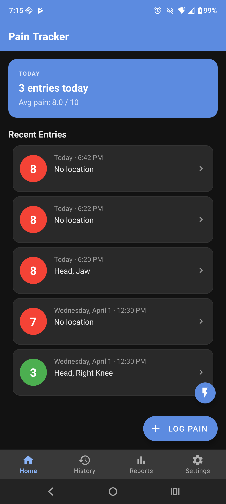
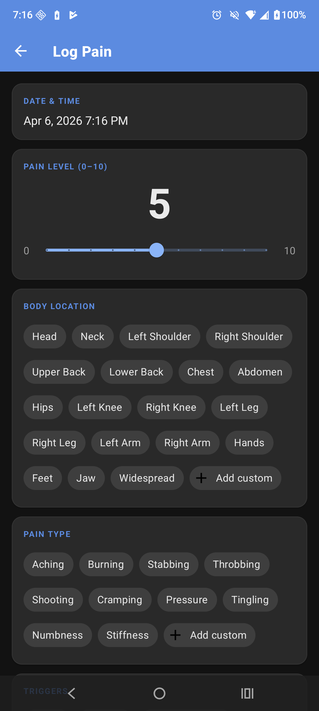
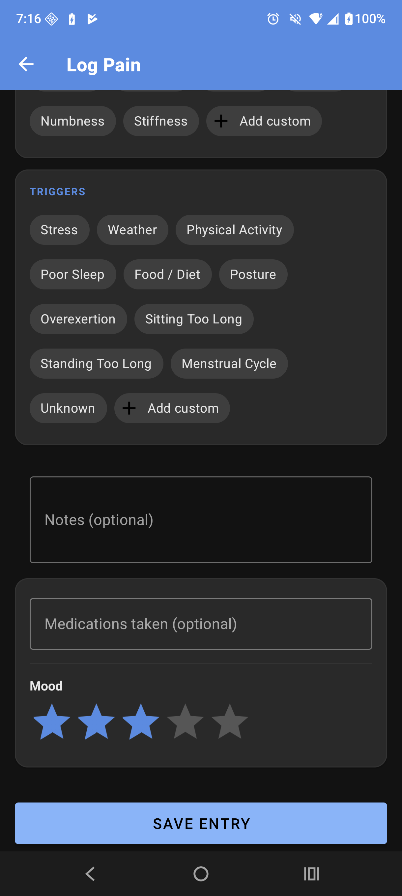
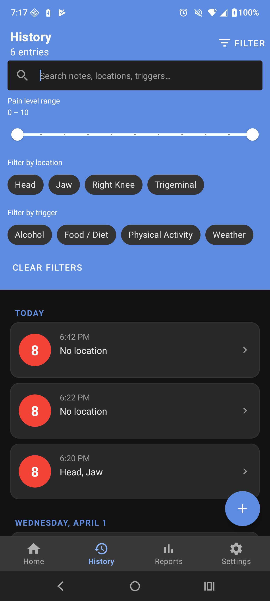
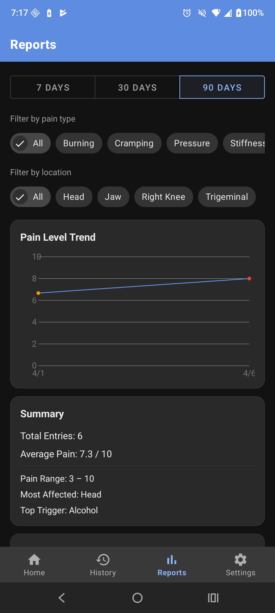
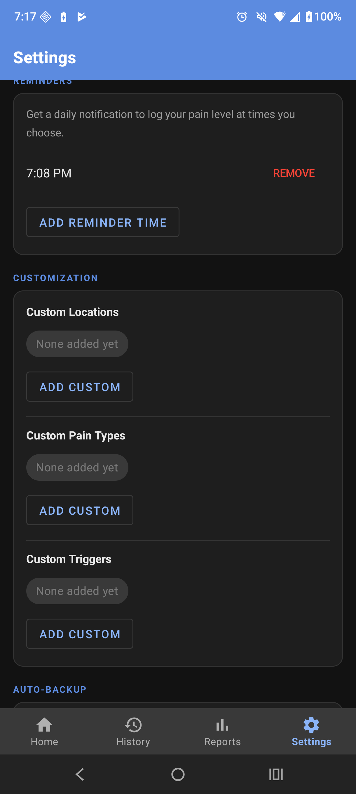
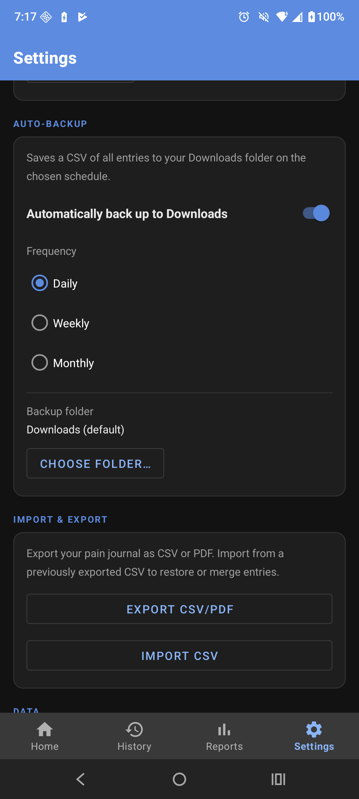

# Pain Journal Free

A free, offline Android app for tracking chronic pain — privately and simply.

All data stays on your device. No accounts, no ads, no internet connection required.

---

## Features

### Log Pain Entries
- Rate pain intensity on a 0–10 slider (color-coded green / orange / red)
- Select body locations, pain types, and triggers via multi-select chips
- Log medications, mood (1–5 stars), sleep quality (1–5 stars), and free-text notes
- Edit the timestamp to backfill entries
- Sleep quality is automatically hidden when logging a second entry on the same day

### Home Screen
- See today's entry count and average pain level at a glance
- Tap any recent entry to edit it
- FAB to quickly log a new entry

### History
- Full entry list grouped by date, newest first
- Swipe left or right to delete with one-tap undo

### Reports & Insights
- Pain trend chart for custom time periods (custom-drawn — no third-party chart library)
- Summary stats: entry count, average pain, min/max range, most common location and trigger
- High-pain analysis (entries rated 7+): common triggers, locations, types, medications, mood and sleep distributions
- Export to **CSV** or a styled **PDF** (includes charts + full entry list)
- Import CSV to restore or merge data from a backup

### Reminders
- Set one or more daily notification reminders at custom times
- Reminders survive device reboots

### Customization
- Add your own body locations, pain types, and triggers
- Swipe to delete custom options with one-tap undo
- Choose Light, Dark, or System default theme

---

## Screenshots

&nbsp;&nbsp;
&nbsp;&nbsp;
&nbsp;&nbsp;
&nbsp;&nbsp;
&nbsp;&nbsp;
&nbsp;&nbsp;

---

## Tech Stack

| Layer | Technology |
|---|---|
| Language | Kotlin |
| Architecture | MVVM + Repository |
| Database | Room (SQLite) |
| Async | Kotlin Coroutines + Flow |
| UI | Material Design 3, View Binding |
| Navigation | Navigation Component (single-activity) |
| Annotation processing | KSP |
| Min SDK | Android 7.0 (API 24) |
| Target SDK | Android 15 (API 36) |

---

## Privacy

- No network permissions
- No analytics or crash reporting
- No accounts or sign-in
- All data is stored locally in a Room database on your device
- Exports are saved to your Downloads folder and never uploaded anywhere

---

## License

This project is licensed under the Apache 2.0 License — see the [LICENSE](LICENSE.MD) file for details.
